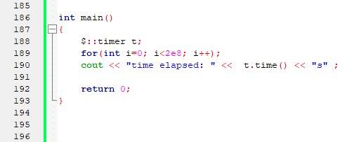
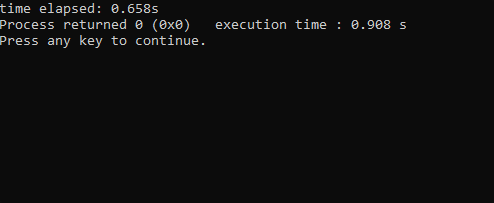
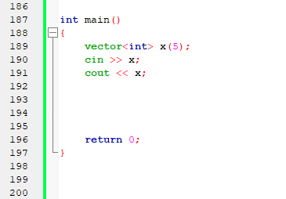
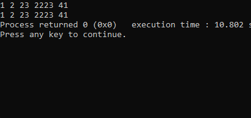
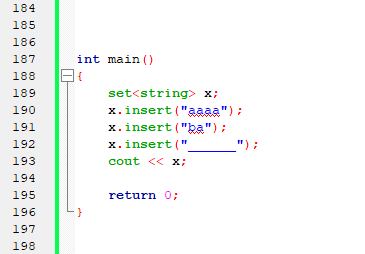
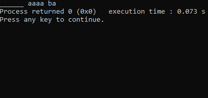
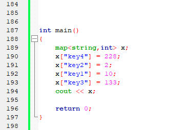
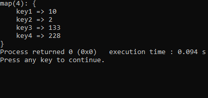
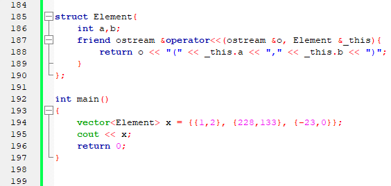
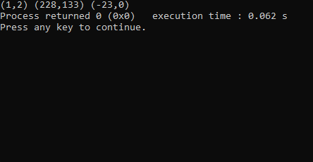

# template
C++ $template

Шаблон, который должен упростить и ускорить процесс написания программы для олимпиадного программирования.

Содержит полезные функциии, классы, константы, а также поддерживает возможность удобного ввода и вывода контейнеров. 

# Функционал

### Функции

* **void $::fastio()**

  Включает [быстрый ввод/вывод](https://codeforces.com/blog/entry/5217?locale=ru)
  
* **void $::file_input(string filename)**
  
  Подключает ввод из файла "**filename**"
  
* **void $::file_output(string filename)**
  
  Подключает вывод в файл "**filename**"

* **void $::files(string filename)**

  Подключает ввод из файла "**filename**.in"
  
  Подключает вывод в файл "**filename**.out"

* **long long $::gcd(long long a, long long b)**

  Возвращает [НОД](https://e-maxx.ru/algo/euclid_algorithm) чисел **a** и **b**
  
* **string $::toBase(long long from, int radix)**
  
  Возвращает представление десятичного числа **from** в системе счисления с основанием **radix**
  
* **long long $::fromBase(string from, int radix)**

  Функция, обратная **toBase()**
  
### Классы

 * **$::timer()**
 
    Простой таймер
    
    **Методы:**
    
      * **double time()**
      
        Возвращает количество секунд, прошедших с момента инициализации
   
   **Пример использования**
   
   
   
   
        
 * **$::DSU(int _size)**
 
   [Система непересекающихся множеств](https://e-maxx.ru/algo/dsu)
   
   **_size** - количество элементов, входящих в систему
   
   При инициализации помещает каждый элемент в отдельное множество
   
   **Методы:**
   
    * **int find(int v)**
    
      Возвращает представителя множества, в котором находится элемент **v**
      
    * **void merge(int v, int u)**
    
      Объединяет два множества, которые содержат элементы **v** и **u**
      
    * **bool is_neighbours(int v, int u)**
    
      Проверяет, находятся ли элементы **v** и **u** в одном множестве
      
    * **int count()**
    
      Возвращает количество множеств
      
      
## Ввод и вывод контейнеров stl

Поддерживаемые контейнеры:
 * **Ввод:**
   * vector
 * **Вывод:**
   * vector
   * set
   * unordered_set
   * map
   * unordered_map
    
### Примеры использования

* **Ввод и вывод vector**

   

   

* **Вывод set**

   

   

* **Вывод map**

   

   

* **Вывод своего класса**

   

   
